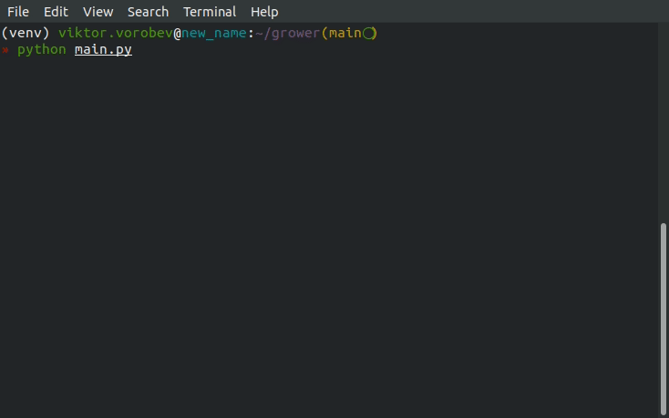

# Grower

A simple (yet probably a bit complicated inside) script that prints out a tree, that look something like that:



Or as text:

```
                                       &|                                       
                                      & ~  &                                    
                                      &|&  &|&&                                 
                                   ~\  &&  &&&~&                                
                                   & |&|&&~&&  &                                
                                     ~&~&&      &                               
                                     &&&&&     |&~                              
                                     &  //  &  / &&                             
                                        \\  |&/&                                
                                        /\ /~\&  &&&                            
                                        //~&\&  &&/&                            
                                        //  &~&  &&                             
                                        |/   &|&&&                              
                                        |/ &/&&|                                
                                       ||/ /  &&                                
                                      /|| |                                     
                                      ||/~~                                     
                                      /\|                                       
                                      /||                                       
                                      /|||                                      
                                      |\\\                                      
                                       /||/                                     
```

## Notice

This project is inspired by John Allbritten [bonsai.sh](https://gitlab.com/jallbrit/bonsai.sh).

## Requirements

Build with Python3.8. Won't work with earlier versions because of dataclasses and type annotations.

## Dependencies

Please take a look at [requirements.txt](https://github.com/victorvorobev/grower/blob/main/requirements.txt).

## Launch

```bash
python3 main.py
```
